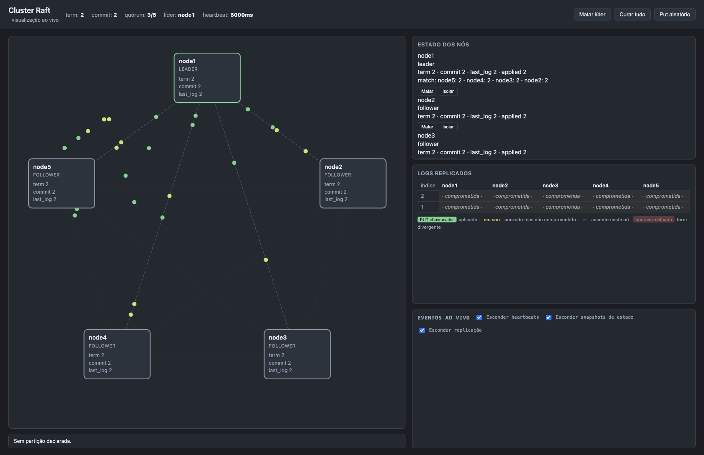
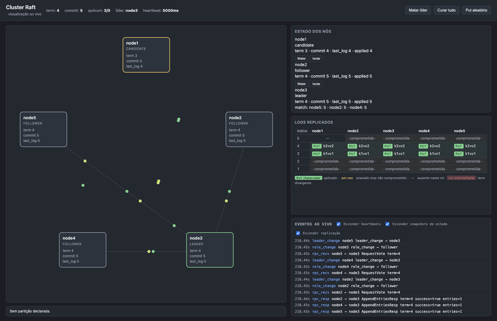
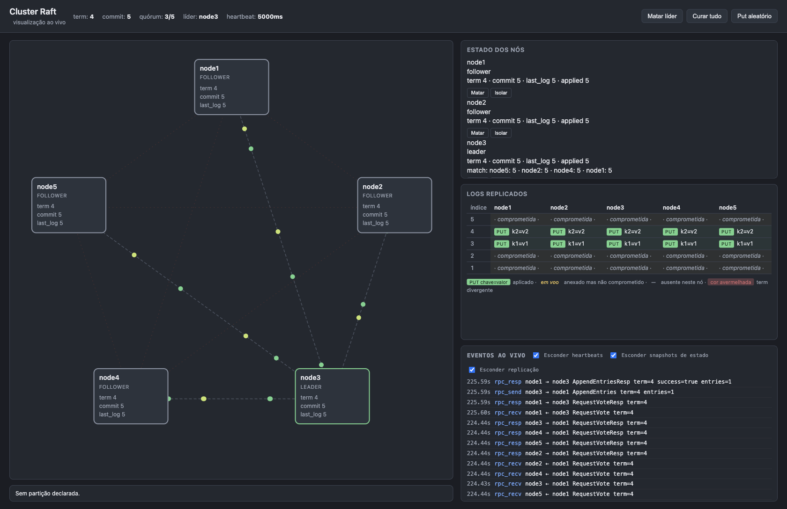
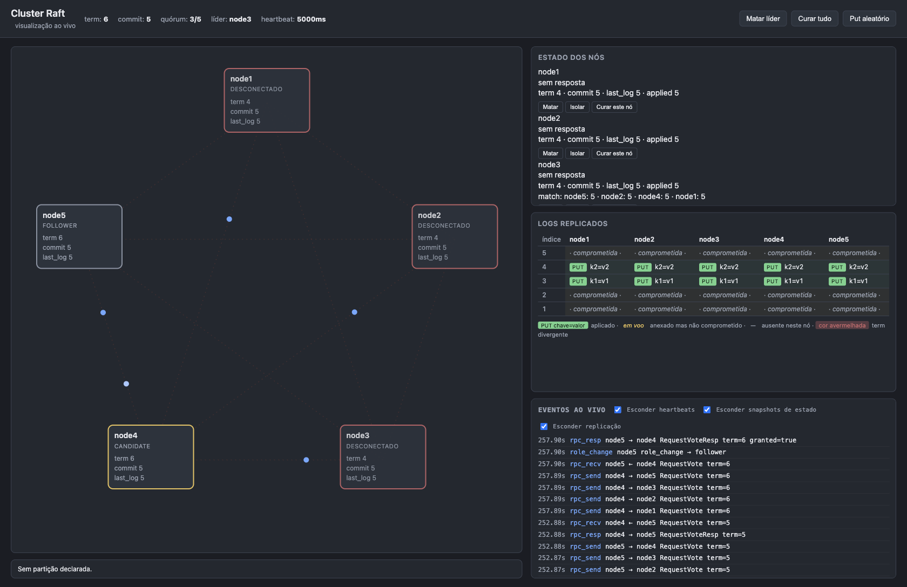

# Relatório — Atividade Prática: Consenso com Raft e Visualizador ao Vivo

**Disciplina:** Sistemas Distribuídos
**Dupla:** Tom Pereira Hunt / Pedro Henrique Gimenez
**Data:** 05/07/2026

> _Nota:_ os screenshots do dashboard estão na pasta `screenshots/` e também
> colamos, junto de cada um, o **estado real capturado via `/status`** de cada nó
> pra deixar os números explícitos. O dashboard fica vivo em `localhost:8080` com
> `docker compose up --build`.

---

## Nível 0 — Observar

### Eleição inicial

1. Qual nó virou candidato primeiro? Você consegue afirmar com certeza por que esse e não outro?

> _Resposta:_ No nosso boot o `node1` virou líder (`term=2`). Não dá pra afirmar
> com certeza qual vira candidato primeiro, porque o *election timeout* de cada nó
> é randomizado — vence quem sorteou o menor timeout e disparou a eleição antes dos
> outros. Numa próxima subida pode ser outro.

2. Quantos votos o candidato precisou para virar líder? Por que esse número e não outro?

> _Resposta:_ Precisou de 2 votos (contando o dele mesmo). Num cluster de 3, a
> maioria estrita (quórum) é `floor(3/2)+1 = 2`. Menos que isso não garante que só
> exista um líder por term.

3. Após a eleição estabilizar, descreva o padrão de pacotes verdes. Qual a finalidade desses heartbeats?

> _Resposta:_ O líder manda `AppendEntries` vazios (heartbeats) de tempos em tempos
> pra cada seguidor (pacotes verdes saindo do verde pros cinzas). Servem pra
> avisar "ainda estou vivo e sou o líder", zerando o *election timeout* dos
> seguidores pra eles não começarem uma eleição à toa.

**Screenshot — cluster estável logo após a eleição (dashboard):**



**Estado real logo após a eleição inicial estabilizar (via `/status`):**

```
node1: role=leader   term=2
node2: role=follower term=2
node3: role=follower term=2
```

---

## Nível 0b — Derrubar líder ao vivo

4. Quanto tempo passou entre a morte do líder e a eleição do novo líder?

> _Resposta:_ Da ordem do *election timeout*, que com `RAFT_HEARTBEAT_MS=5000` fica
> em ~10s (2× heartbeat). Nas nossas medidas, depois de matar o líder os outros dois
> viravam candidatos e um novo líder assumia em ~10 a 15s. Esse é o *recovery time*.

5. O `term` subiu ou desceu após a nova eleição? Por quê não pode descer?

> _Resposta:_ Subiu sempre. Cada nova eleição incrementa o term (é um relógio
> lógico). Não pode descer porque a regra do Raft é: ao ver uma mensagem com
> `term > currentTerm`, o nó adota o term maior; e ele nunca aceita nem gera term
> menor que o que já viu. Se pudesse descer, dava pra ter dois líderes no mesmo term.

6. Quando o nó morto voltou e virou follower, ele "esqueceu" que tinha sido líder? Onde no dashboard se vê essa transição?

> _Resposta:_ Sim, ele volta como follower e adota o term atual assim que recebe o
> primeiro `AppendEntries` do novo líder — não tenta reassumir a liderança. No
> dashboard isso aparece no card dele voltando de vermelho (parado) pra cinza
> (follower) e no stream de eventos como um `role_change` / `leader_change`.

7. Compare com um servidor único (sem replicação).

> _Resposta:_ Num servidor único, se ele cai o serviço fica **fora do ar até alguém
> reiniciar na mão** — indisponibilidade indefinida, e pior, pode perder dados. No
> Raft o cluster se reelege sozinho em ~10s e continua servindo, sem intervenção.

---

## Nível 1 — Inspecionar

### 1.1 Os três papéis

| Papel | Cor no dashboard | Pode receber `AppendEntries`? | Pode enviar `AppendEntries`? | Como sai desse papel? |
|-------|------------------|-------------------------------|------------------------------|----------------------|
| Follower | cinza | Sim (do líder atual) | Não | Vira candidate quando estoura o *election timeout* sem receber heartbeat. |
| Candidate | amarelo | Sim (se vier de um líder com term ≥ o dele, ele volta a follower) | Não | Vira leader se ganhar a maioria dos votos; volta a follower se descobrir líder/term maior; ou reinicia eleição se der timeout. |
| Leader | verde | Só se chegar term maior (aí ele deixa de ser líder) | Sim (heartbeats e replicação) | Volta a follower ao descobrir um `term` maior que o seu. |

---

### 1.2 Term é monotônico

Sequência real de `term`s (derrubando o líder 3 vezes seguidas):

| Iteração | Term observado após eleição |
|----------|----------------------------|
| Inicial | 2 |
| Após 1ª morte | 3 |
| Após 2ª morte | 5 |
| Após 3ª morte | 7 (estabilizou em 8) |

1. A sequência é estritamente crescente, ou houve repetição/decremento?

> _Resposta:_ Estritamente crescente (2, 3, 5, 7, 8). Nunca repetiu nem caiu. Alguns
> saltos foram de 2 em 2 porque houve *split vote* (os dois seguidores viraram
> candidatos no mesmo term, ninguém ganhou de primeira, e cada tentativa
> incrementou o term de novo).

2. Cenário em que decrementar `term` quebraria *Election Safety*.

> _Resposta:_ Imagina que o líder do term 5 caia e o cluster eleja um novo líder no
> term 6. Se o term velho pudesse "voltar" pra 5, o líder antigo (que ainda acha que
> está no term 5) seria aceito como válido de novo, e aí teríamos dois líderes
> reconhecidos no term 5 ao mesmo tempo. Isso viola a Election Safety, que diz que
> pode haver no máximo um líder por term.

3. Mecanismo que garante que `term` nunca decremente.

> _Resposta:_ A regra "ao receber mensagem com `term > currentTerm`, atualize
> `currentTerm` e vire follower", junto com o fato de o `currentTerm` ser persistido
> e o nó nunca votar/aceitar term menor que o dele. O term só se move pra cima.

---

### 1.3 Quórum e comprometimento de entradas

1. Quantas confirmações o líder precisou antes de marcar a entrada como comprometida?

> _Resposta:_ Precisou da maioria: 2 de 3 (o próprio líder mais 1 seguidor). No teste,
> o `put chave_a` voltou `{"index":6,"ok":true}` e logo os três nós mostravam
> `chave_a` no store com `commit_idx=6`.

2. Em 3 nós, quantos precisam responder? E se um nó está caído?

> _Resposta:_ Precisam de 2 (maioria de 3). Se um nó está caído, ainda dá pra
> comprometer, porque sobram 2 = maioria. Confirmamos: derrubamos um seguidor e o
> `put chave_b` ainda voltou `{"index":7,"ok":true}`. Aí derrubamos o segundo
> seguidor (só o líder vivo) e o `put chave_c` falhou com
> `apply: leadership lost while committing log` — a entrada ficou no log
> (`last_log_idx=8`) mas não avançou o `commit_idx` (parou em 7). Sem maioria, não
> compromete.

3. Por que a entrada vira verde nos seguidores depois do líder? Qual mensagem informa o novo `commitIndex`?

> _Resposta:_ Porque quem decide que a entrada foi comprometida é o líder, no momento
> em que junta os acks da maioria — ele avança o `commitIndex` primeiro. Os seguidores
> só ficam sabendo do novo `commitIndex` no próximo `AppendEntries` (que carrega o
> campo `leaderCommit`). Por isso tem aquela defasagem de até um heartbeat entre o
> líder aplicar e os seguidores aplicarem.

**Estado real (após `put chave_a` no líder node3):**

```
node1(follower) store={"chave_a":"valor_a"} commit_idx=6
node2(follower) store={"chave_a":"valor_a"} commit_idx=6
node3(leader)   store={"chave_a":"valor_a"} commit_idx=6
```

---

### 1.4 Partição minoritária

1. A escrita contra o nó isolado falhou ou foi redirecionada? O que reportou?

> _Resposta:_ Foi redirecionada/rejeitada. Isolamos o `node1` (seguidor) e o
> `put` contra ele voltou:

```
{"error":"not leader","leader_id":"node2","node":"node1"}
```

> Ele sabe que o líder é o `node2`, mas isolado não consegue encaminhar, então recusa.

2. A escrita contra o líder (lado majoritário) foi bem-sucedida?

> _Resposta:_ Sim. O `put` contra o `node2` (líder, do lado da maioria) voltou
> `{"index":9,"ok":true}` e entrou como entrada comprometida. O lado majoritário
> continua funcionando normal.

3. O `node1` isolado tentou virar candidato? O que aconteceu com o `term` dele?

> _Resposta:_ Sim. Durante o isolamento ele virou candidate e o `term` dele começou a
> subir sozinho (observamos ir de 9 pra 10 e continuar), porque ele não recebia
> heartbeat de ninguém e ficava reiniciando eleição.

4. Por que `node1` sozinho não elege líder? Qual regra impede?

> _Resposta:_ Porque pra virar líder ele precisa de votos da maioria do cluster
> inteiro (2 de 3), e sozinho ele só tem o próprio voto. A regra de que a eleição
> exige quórum (maioria) impede que uma partição minoritária eleja um líder próprio.

---

### 1.5 Partição majoritária e reconciliação de log

**Screenshot — ANTES da cura:** líder velho isolado como candidato (amarelo, term menor) e novo líder verde em outro term; no painel de logs o índice mais novo aparece `—` (ausente) no nó isolado.



**Screenshot — DEPOIS da cura:** o nó que estava isolado voltou a follower e seu log convergiu (índice antes ausente agora `comprometida` em todos).



**Estado real ANTES da cura (líder velho `node2` isolado, log com entradas não comprometidas):**

```
node2(isolado) role=candidate term=13 commit_idx=10 last_log_idx=11
               store={"chave_a","chave_b","key_major"}   # SEM os zumbis
novo lider node3 term=14, ja com chave_real comprometida no lado da maioria
```

**Estado real DEPOIS da cura (`node2` reconciliado):**

```
node2 role=follower term=14 commit_idx=12 last_log_idx=12
      store={"chave_a","chave_b","chave_real","key_major"}
# os tres nos convergiram para o MESMO store, com chave_real e SEM os zumbis
```

1. As entradas `chave_zumbi_a`/`chave_zumbi_b` sobreviveram? Onde foram parar?

> _Resposta:_ Não sobreviveram. Elas nunca chegaram a ser comprometidas (o `node2`
> isolado não tinha quórum — o `put` zumbi voltou `apply: leadership lost while
> committing log`), então ficaram só como entradas não-comprometidas no log dele. Na
> reconciliação, o log do `node2` foi reescrito pelo do novo líder e essas entradas
> foram descartadas (truncadas). Sumiram.

2. Por que `node2` aceitou ter o log reescrito? Qual campo o convenceu?

> _Resposta:_ Porque o `AppendEntries` do novo líder chegou com um `term` maior
> (14 > 13). Ao ver term maior, o `node2` volta a ser follower e passa a aceitar o
> líder daquele term. Aí a checagem de consistência do log (prevLogIndex/prevLogTerm)
> faz ele truncar o que diverge e copiar as entradas do líder. Foi o campo `term` que
> o convenceu a se render.

3. A qual das cinco garantias isso corresponde? Descreva.

> _Resposta:_ É a **Leader Completeness** (junto com Log Matching e State Machine
> Safety). Ela diz que qualquer entrada já comprometida aparece no log de todos os
> líderes futuros — ou seja, um novo líder sempre tem todas as entradas comprometidas.
> Por isso o `chave_real` (comprometido pela maioria) sobreviveu e virou o histórico
> oficial, enquanto os zumbis não-comprometidos puderam ser jogados fora sem
> problema.

4. Se as entradas tivessem sido **comprometidas antes da partição**, poderiam ser descartadas?

> _Resposta:_ Não. Se tivessem alcançado maioria (comprometidas), a Leader
> Completeness garante que qualquer líder futuro já as tem no log, então nenhum líder
> novo poderia ter sido eleito sem elas, e não teria como descartá-las. O que
> permitiu descartar os zumbis foi justamente eles **não** terem sido comprometidos.

---

## Nível 2 — Modificar

Modificação feita no `docker-compose.yml`: adicionamos `node4` e `node5` copiando o
padrão dos nós, atualizamos `RAFT_PEERS` nos cinco nós pra listar os cinco endereços,
`RAFT_NODES` no `dashboard` e no `broker` pra `"node1,...,node5"`, e adicionamos os
volumes `node4-data` e `node5-data`. Subimos com `docker compose down -v && docker
compose up --build` (o `down -v` é crucial pra limpar a config de 3 nós persistida).

**Screenshot — cabeçalho do dashboard com `quórum: 3/5` (cluster de 5 nós):**


**Estado real do cluster de 5 nós (quórum = 3/5):**

```
node1: role=leader   term=2
node2: role=follower term=2
node3: role=follower term=2
node4: role=follower term=2
node5: role=follower term=2
```

**Tolerância a 2 falhas (matamos líder + 1 nó, sobram 3):**

```
node2 role=follower term=10
node3 role=leader   term=10     <- novo lider entre os 3 vivos
node5 role=follower term=10
put com 3/5 vivos -> {"index":5,"ok":true}   (quorum atingido, escrita funciona)
```

**Tolerância esgotada (matamos um 3º nó, sobram 2):**

```
node4 role=candidate/follower term=5->6   (terms sobem, ninguem vira lider)
node5 role=candidate/follower term=5->6
put com so 2 vivos -> {"error":"not leader","leader_id":"","node":"node5"}
```

**Screenshot — cluster paralisado após 3 falhas:** três nós vermelhos (parados), os dois vivos ficam como candidato/follower amarelo com o `term` subindo (RequestVote no stream) e nenhum vira verde.



1. Com 5 nós, quantas falhas simultâneas tolera? Compare com 3.

> _Resposta:_ Tolera 2 falhas (quórum 3/5: com 3 vivos ainda tem maioria). Confirmamos
> matando líder + 1 nó e o cluster reelegeu e continuou aceitando escrita. Um cluster
> de 3 tolera só 1 falha (quórum 2/3). Ao matar o 3º nó (sobrando 2), o cluster de 5
> travou: candidatos com term subindo perpetuamente e o `put` recusado.

2. Se escalasse para 6 nós (par), quantas falhas tolera? Por que pares são desencorajados?

> _Resposta:_ 6 nós toleram 2 falhas (quórum 4/6: precisa de 4, sobrevive com 4).
> Ou seja, o 6º nó não aumenta a tolerância em relação a 5 (que já tolera 2), só
> adiciona custo e mais chance de *split vote*. Por isso tamanhos pares são
> desencorajados: você paga um nó a mais sem ganhar tolerância. Tamanhos ímpares dão
> a melhor tolerância por nó.

3. Qual o trade-off de aumentar o cluster?

> _Resposta:_ Mais nós = mais tolerância a falhas, mas o líder precisa replicar pra
> mais gente e esperar a maioria (maior) confirmar, então a **latência de commit
> sobe** e o **overhead de mensagens** também. É troca de desempenho por
> disponibilidade/durabilidade.

4. Em que cenário real você escolheria 5 em vez de 3?

> _Resposta:_ Quando precisa sobreviver a 2 falhas ao mesmo tempo — por exemplo,
> distribuir os nós em 3 zonas de disponibilidade e ainda aguentar perder uma AZ
> inteira e mais um nó, ou fazer *rolling upgrade* (derrubando um nó de propósito) e
> ainda tolerar uma queda inesperada durante a janela. Em troca de um pouco mais de
> latência.

---

## Observações livres

_(Comportamentos inesperados, erros encontrados, dificuldades técnicas — descreva o que aconteceu e como você resolveu)_

> - O erro `apply: leadership lost while committing log` foi ótimo pra ver na prática
>   a diferença entre "entrada anexada no log" e "entrada comprometida": sem quórum, o
>   `last_log_idx` sobe mas o `commit_idx` não.
> - A parte mais legal foi a partição majoritária: dá pra ver o líder velho isolado
>   virando candidato com term subindo enquanto o lado da maioria já elegeu outro
>   líder e seguiu a vida. Na cura, o log do isolado é reescrito e os "zumbis" somem —
>   Leader Completeness na prática.
> - No cluster de 5, esbarramos num detalhe de timing: se a gente consultava o
>   `/status` no meio da reeleição, pegava os nós como `candidate` antes de assentar.
>   Bastou esperar a eleição terminar (~15-25s no `HEARTBEAT_MS=5000`) pra ver o novo
>   líder e a escrita voltando a funcionar.
> - Foi crucial o `docker compose down -v` ao mudar de 3 pra 5 nós: sem limpar os
>   volumes, o estado do cluster de 3 nós persistido em disco ignorava os nós novos.

---

## Dúvida para a próxima aula

_(Formule uma pergunta substantiva que surgiu durante a atividade)_

> Nos nossos testes o `RAFT_HEARTBEAT_MS` estava em 5000 pra dar pra acompanhar, e o
> *recovery time* ficou em ~10-15s. Em produção o Raft roda em ~150-300ms. Como se
> escolhe esse valor na vida real? Tem um piso prático (RTT da rede, jitter) abaixo do
> qual diminuir o heartbeat vira tiro no pé, causando eleições desnecessárias por
> falso timeout mesmo com o líder vivo?
